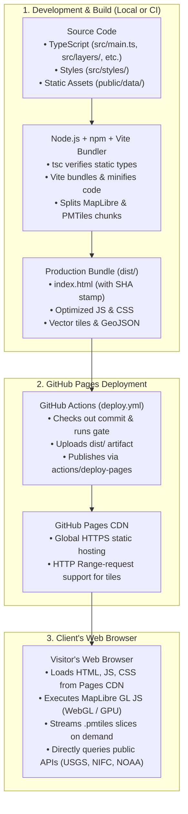
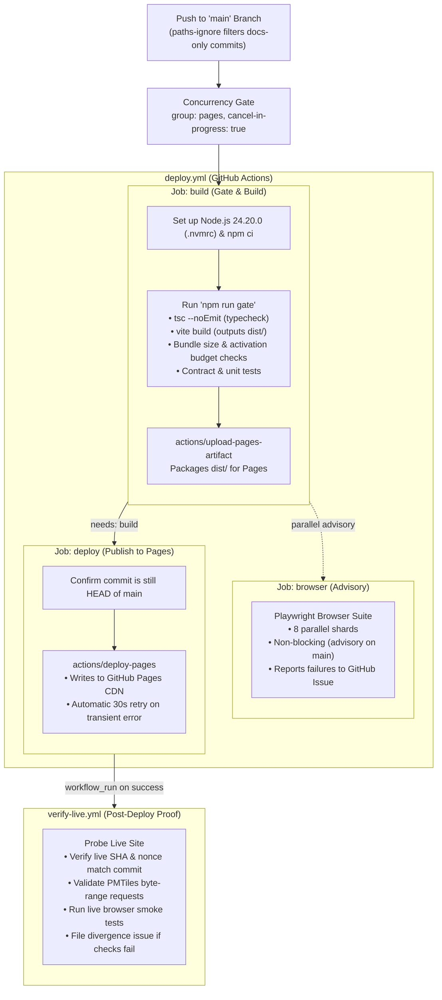

# How DDM Builds and Launches a Serverless Interactive Website

**Prompt:**

Explain how this repo uses `npm` or other tools to launch an interactive website via GitHub Pages. Likely there is useful information in `DEVELOPER.md`, `.nvmrc` and `.github/`. Include information on what is `npm` and other tools for a developer unfamiliar with this approach. Save in `EXPLAIN_NPM.md` in this directory.

**Model Answer:**

This guide explains how this repository uses **Node.js**, **npm**, **Vite**, and **GitHub Actions** to build, verify, and host a serverless interactive, high-performance web mapping application on **GitHub Pages**. It is written for developers, data scientists, and researchers who may be more familiar with Python, R, or traditional server architectures than the modern JavaScript/TypeScript ecosystem.

---

## 1. High-Level Architecture: How It Works Without a Backend

A common point of confusion for data scientists and developers coming from R (Shiny) or Python (Streamlit, Flask, Django) is: **how can a complex, interactive mapping tool run on GitHub Pages without a backend server?**



### Key Differences from Server-Driven Apps

- **R Shiny / Streamlit**: Require an active R or Python process running on a server 24/7 to compute data, filter tables, and render graphics whenever a user clicks a button.
- **Dynamic Drought Module (DDM) on GitHub Pages**: Has **zero application backend**.
  - All source TypeScript code is compiled down beforehand into static HTML, JavaScript, and CSS.
  - The map rendering engine (MapLibre GL JS) uses the visitor's computer/phone GPU via WebGL.
  - Data layers are either pre-compiled into static vector tile archives (`.pmtiles` and `.geojson` in `public/data/`) or fetched directly from public REST endpoints (USGS stream gauges, NIFC wildfires, etc.).
  - GitHub Pages simply acts as a high-speed static file server (CDN) delivering those static files to the browser.

---

## 2. Fundamentals: Tooling Explained for Non-Node Developers

If you are unfamiliar with the Node.js and npm ecosystem, here is how each piece maps to concepts in Python or R:

| Tool / Concept | What it is | Python Analogy | R Analogy | Role in this Project |
| :--- | :--- | :--- | :--- | :--- |
| **Node.js** | JavaScript runtime engine outside the browser | Python interpreter (`python3`) | R executable (`R`) | Runs build scripts, testing tools, and compilers on developers' laptops and GitHub servers. |
| **`.nvmrc`** | Node Version Manager config file | `.python-version` (pyenv) | `.Rversion` / `renv.lock` R version | Enforces that everyone uses the exact pinned version of Node (**24.20.0**). |
| **npm** | Node Package Manager | `pip` + `venv` / `poetry` / `uv` | `install.packages()` + `renv` | Downloads third-party libraries and runs workflow scripts. |
| **`package.json`** | Project manifest and task definition | `pyproject.toml` / `requirements.txt` | `DESCRIPTION` file | Lists dependencies, licenses, and command-line scripts. |
| **`package-lock.json`** | Cryptographic lockfile | `poetry.lock` / `requirements.lock` | `renv.lock` | Locks the exact checksums and versions of every transitive dependency. |
| **`npm ci`** | "Clean Install" command | `pip install --no-deps -r ...` | `renv::restore()` | Strictly installs from `package-lock.json` without modifying it. Used in CI and automated builds. |
| **`npm run <name>`** | Script runner | `make <task>` or `poetry run <task>` | `devtools::check()`, custom Makefile | Executes scripts defined in the `"scripts"` block of `package.json`. |
| **TypeScript (`tsc`)** | Statically typed JavaScript | Python type hints (`mypy`) | Static linters / type checkers | Catches errors before runtime; compiled away during build. |
| **Vite** | Modern frontend bundler & dev server | Not typically used; like a fast webpack/Sphinx | `pkgdown` / Quarto asset compiler | Assembles TypeScript, stylesheets, and assets into an optimized `dist/` bundle. |
| **Playwright** | Browser automation test framework | `pytest-playwright` / Selenium | `shinytest2` | Boots a headless browser and verifies user clicks, map interactions, and accessibility. |

---

## 3. Configuration Files in This Repository

### 1. `.nvmrc`

The single line `24.20.0` pins the exact patch release of Node.js Active LTS.

- Developers use `nvm use` to switch to this version locally.
- GitHub Actions reads this file with `actions/setup-node` (`node-version-file: .nvmrc`) so that cloud runners execute identical binaries.

### 2. `package.json`

Located at the root of the repository, this file organizes three crucial things:

1. **Engines**: Requires `node >= 24.0.0`.
2. **Dependencies**:
   - `dependencies`: Runtime libraries that ship into the user's browser (e.g., `maplibre-gl` for maps, `pmtiles` for reading archived vector tiles, `@preact/signals` for UI reactivity).
   - `devDependencies`: Development-only tools that never get sent to the end user (e.g., `typescript`, `vite`, `@playwright/test`, `mapshaper`).
3. **Scripts**: Command shortcuts executed via `npm run <name>`. Essential ones include:
   - `npm run dev`: Starts the local development server at `http://localhost:5173`.
   - `npm run build`: Runs TypeScript typechecking (`tsc --noEmit`) and invokes `vite build`.
   - `npm run preview`: Boots a local static HTTP server at `http://localhost:4173` serving the built `dist/` directory for production simulation.
   - `npm run gate`: Deterministic quality gate; builds `dist/`, checks bundle sizes and activation budgets, and runs all unit contracts.
   - `npm run test:serial`: Runs end-to-end browser tests via Playwright.

### 3. `vite.config.ts`

The configuration file for the Vite build tool. Key decisions implemented here:

- **`base: './'`**: Forces all asset links (scripts, CSS, images) to be relative rather than absolute (`/`). This allows the app to be hosted under a root domain, a GitHub Pages subfolder (e.g., `/dynamic-drought-module/`), or inside an iframe.
- **Build Stamping (`DDM_BUILD_SHA` and `DDM_BUILD_NONCE`)**: Injects the exact Git commit SHA and CI run identifier into the compiled HTML. When deployed, automated verification scripts read `document.documentElement.dataset.ddmBuildSha` to prove the live website actually runs the code that was merged.
- **Code Splitting (`rolldownOptions`)**: Isolates the heavy `maplibre-gl` (approx. 800 kB) and `pmtiles` libraries into dedicated chunks so browser caches preserve them across application updates.
- **`outDir: 'dist'`**: Instructs Vite to output the final website into the `dist/` folder.

---

## 4. How the GitHub Actions Pipeline Deploys to GitHub Pages

The automated deployment pipeline is governed by files in `.github/workflows/`:



### Detailed Breakdown of Workflow Files

#### A. `.github/workflows/deploy.yml`

This is the primary deployment workflow. It triggers automatically when code lands on the `main` branch:

1. **Paths Ignore**: It ignores edits to pure documentation files (like `docs/**`, `*.md`). Documentation updates do not alter code in `dist/`, avoiding unnecessary rebuilds.
2. **Concurrency Control**: It specifies `concurrency: group: pages, cancel-in-progress: true`. If multiple commits land in quick succession, older in-progress builds are cancelled so only the newest commit is deployed, preventing race conditions on GitHub Pages.
3. **Least Privilege Security**: The `build` job has read-only permissions (`contents: read`, `pages: read`). Only the specific `deploy` job is granted `pages: write` and `id-token: write` to authenticate with GitHub's OpenID Connect (OIDC) token issuer.
4. **Build & Gate**: It executes `npm ci` followed by `npm run gate`. If any TypeScript error, bundle size violation, or data inconsistency exists, the build halts and nothing is deployed.
5. **Publish to Pages**:
   - `actions/configure-pages`: Prepares GitHub Pages metadata.
   - `actions/upload-pages-artifact`: Packages `dist/`.
   - `actions/deploy-pages`: Publishes the packaged files directly to the GitHub Pages environment.

#### B. `.github/workflows/verify-live.yml`

A unique engineering practice in this repository is that **merging a commit is not considered proof that the release succeeded**.

- Once `deploy.yml` succeeds, `verify-live.yml` wakes up.
- It queries the public site (`https://atniclimate.github.io/dynamic-drought-module/` or configured domain).
- It verifies that the deployed commit SHA stamped on the page matches the repository SHA.
- It tests that the web server properly handles HTTP `Range` requests (vital for MapLibre streaming `.pmtiles` vector tiles without downloading whole gigabyte files).
- If divergence is detected, it automatically files a GitHub Issue alerting maintainers.

---

## 5. Local Developer Workflow: Running and Building Locally

If you want to test and run this application on your local machine:

### 1. Install Node.js

Ensure you have Node.js 24 installed. If you use `nvm` (Node Version Manager):

```bash
nvm install
nvm use
```

### 2. Install Project Dependencies

Run `npm ci` (rather than `npm install`) to ensure you install the exact versions locked in `package-lock.json`:

```bash
npm ci
```

### 3. Start the Interactive Local Development Server

```bash
npm run dev
```

Open `http://localhost:5173` in your browser. Any change you make to TypeScript, HTML, or CSS files will immediately update in your browser using Hot Module Replacement (HMR).

### 4. Build and Preview the Production Site

To test the exact static output that will be uploaded to GitHub Pages:

```bash
# 1. Typecheck and build the static bundle into dist/
npm run build

# 2. Preview the built dist/ folder on a local production-style server
npm run preview
```

Visit `http://localhost:4173`.

### 5. Run the Deterministic Quality Gate

Before pushing changes to GitHub, run:

```bash
npm run gate
```

This executes the exact checks that the GitHub Actions `deploy.yml` workflow will run in the cloud.

---

## 6. Summary: The Lifecycle at a Glance

1. **Write Code**: Developers edit TypeScript files in `src/` and assets in `public/`.
2. **Typecheck & Bundle**: `npm run build` runs `tsc` to verify type safety and `vite build` to generate static assets into `dist/`.
3. **Validate**: `npm run gate` ensures bundle size, schemas, and contracts pass.
4. **Continuous Deployment**: On push to `main`, GitHub Actions (`deploy.yml`) runs the gate, bundles `dist/`, and publishes it to GitHub Pages via `actions/deploy-pages`.
5. **Serve Client-Side**: Users open the site in their browser. The client browser executes MapLibre GL JS, streams vector tiles, and pulls live environmental data directly without needing a custom application server.
6. **Live Verification**: `verify-live.yml` probes the live site to ensure the deployed bytes, build SHA, and tile-range queries are healthy.
